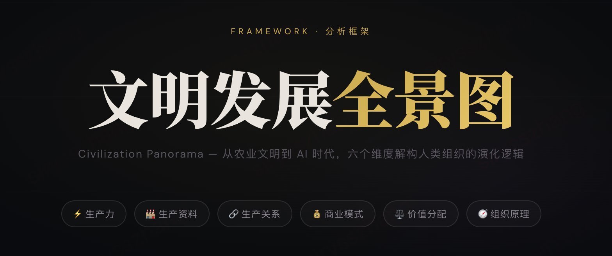

<div align="center">

# 文明发展全景图

### Civilization Panorama

**从农业文明到 AI 时代，六个维度解构人类组织的演化逻辑**



[](https://developer.mozilla.org/en-US/docs/Web/HTML)
[](https://developer.mozilla.org/en-US/docs/Web/CSS)
[](https://developer.mozilla.org/en-US/docs/Web/JavaScript)
[](LICENSE)

[🔗 在线预览 Live Demo](https://siryzhang.github.io/civilization-panorama/) · [📖 阅读说明](#项目概述) 

</div>

---

## 项目概述

> 技术革命从不只是工具的迭代——它重塑生产关系、颠覆商业逻辑、重新分配权力与财富，并迫使组织回答一个根本性问题：**人，为何而聚？**

**文明发展全景图** 是一个交互式信息可视化网页，以六维矩阵框架系统性地梳理了人类文明从农业时代到 AI 时代的演化脉络。它不是一份历史年表，而是一套 **分析工具**——帮助读者在宏大叙事中找到结构性规律，并以此推演 AI 时代的走向。

## 六维分析框架

| 维度 | 核心问题 | 
|:---|:---|
| ⚡ **生产力** | 技术如何重新定义"劳动"的边界？ |
| 🏭 **生产资料** | 谁控制了这个时代的核心资源？ |
| 🔗 **生产关系** | 人与人、人与组织的协作范式如何演变？ |
| 💰 **商业模式** | 价值如何被创造、捕获与交换？ |
| ⚖️ **价值分配** | 技术红利最终流向了谁？ |
| 🧭 **组织第一性原理** | 组织为何存在？人在其中的不可替代性是什么？ |

每个维度横跨四个时代：**农业 → 工业 → 信息 → AI**，形成 6×4 的完整分析矩阵。

## 内容亮点

- 🔍 **六条横向演化规律** — 从历史中提炼的跨时代规律，如"替代层级上移律""解放-重捕螺旋律""持续上游迁移律"等
- 🔮 **六项未来预测** — 基于规律推演的 AI 时代走向，标注确定性等级与关键不确定性
- 🧠 **组织第一性原理** — 从"礼制人事官"到"组织智能官"，追溯人的管理职能的完整进化链
- ⚖️ **价值分配公式** — 每个时代的财富分配结构，揭示技术革命中谁获益、谁被替代

## 交互特性

- 🌙 深色沉浸式视觉体验，适配屏幕阅读与社交分享
- 📌 Sticky 时代导航栏，点击即高亮对应时代的全部卡片
- ✨ 滚动触发的渐入动画（Intersection Observer）
- 📊 顶部彩色阅读进度条
- 📱 完整响应式适配（桌面 4 列 / 平板 2 列 / 手机 1 列）
- ⬆️ 一键回到顶部

## 技术栈

纯前端实现，**零依赖、零构建**，单文件即完整应用。

- **HTML5** — 语义化结构
- **CSS3** — CSS Variables / Grid / Backdrop Filter / 自定义动画
- **Vanilla JS** — Intersection Observer API / Scroll Events
- **Google Fonts** — Noto Serif SC + Noto Sans SC + Instrument Serif + DM Sans

## 项目结构

```
civilization-panorama/
├── index.html      # 完整应用（单文件，零依赖）
├── preview.png     # 项目预览图
└── README.md
```

## 适用场景

- 📚 组织管理 / 人力资源领域的教学与研究参考
- 🎤 AI 时代趋势分享的演讲辅助材料
- 💡 战略规划讨论中的结构化思考框架
- 🧩 个人知识体系中"文明演化"模块的系统性梳理


<div align="center">

**如果这个项目对你有启发，欢迎 ⭐ Star 支持**

*"预测不是宿命，而是行动的坐标系。"*

</div>
